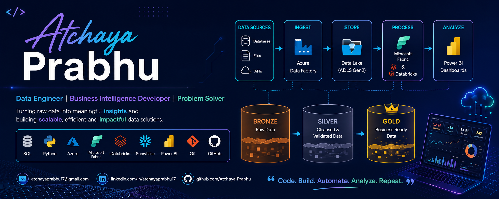

  

<h1 align="center">Hi 👋, I'm Atchaya Prabhu</h1>

<h3 align="center">
Data Analyst • Business Intelligence Professional • Data Engineering Enthusiast
</h3>

---

## 👩‍💻 About Me

🔹 Data & Business Intelligence professional with **3+ years of experience** developing dashboards, automating reporting, and delivering data-driven insights.

🔹 Passionate about transforming raw data into meaningful business solutions through analytics, visualization, and modern cloud technologies.

🔹 Enhancing my cloud and data engineering skills with **Azure** and **Microsoft Fabric** while remaining passionate about **Business Intelligence**, **Data Analytics**, and **Data Engineering**.

---

## 🚀 Current Focus

- 🔭 Building **End-to-End Azure & Microsoft Fabric Data Engineering Projects**
- 🌱 Learning **Microsoft Fabric, Azure Data Factory, Azure Databricks, PySpark, Azure Synapse Analytics, Data Warehousing & CI/CD**
- 👯 Looking to collaborate on **Power BI, SQL, Azure, Microsoft Fabric, and Data Engineering projects**
- 💬 Ask me about **SQL, Power BI, DAX, Data Modeling, Microsoft Fabric, Azure Data Factory, Python & Excel**
- 📫 Reach me at **atchayaprabhu17@gmail.com**
- 👨‍💻 Portfolio: **https://github.com/Atchaya-Prabhu**
- ⚡ Fun fact: **Outside work, you'll usually find me practicing Bharatanatyam or dancing to my favorite songs. 💃**

---

## 🌐 Connect With Me

---

## 💻 Tech Stack

---
## 💼 Roles of Interest

- 📊 Data Engineer
- ☁️ Azure Data Engineer
- ⚙️ Analytics Engineer
- 🌐 Cloud Data Engineer
- 🏗️ Data Platform Engineer
- 📈 Data Analytics Engineer
## 🚀 Featured Projects

| Project | Description |
|---------|-------------|
| 📊 **Loan Portfolio Analytics Dashboard** | Interactive Power BI dashboard with SQL Server, DAX, KPI tracking, Star Schema, and business insights. |
| ☁️ **Spotify Azure Data Engineering** | End-to-end Azure data pipeline using Azure Data Factory, Azure Data Lake, Databricks, PySpark, and Synapse Analytics. |
| 🛍️ **ShoppingMart End-to-End Analytics (Microsoft Fabric)** | End-to-end analytics solution built with Microsoft Fabric using Lakehouse, OneLake, Data Pipelines, PySpark, Medallion Architecture, and Power BI dashboards. |
| 🧹 **SQL Layoffs Data Cleaning** | Cleaned and transformed real-world layoff data using SQL, CTEs, window functions, and data quality techniques. |

➡️ **Explore all projects:**  
**https://github.com/Atchaya-Prabhu?tab=repositories**

---

## 📊 GitHub Statistics

---

## 🔥 GitHub Streak

---

## 📚 Currently Learning

- ☁️ Microsoft Fabric
- ⚙️ Azure Data Factory
- 🚀 Azure Databricks
- 🐍 PySpark
- 🏗️ Azure Synapse Analytics
- 🗄️ Data Warehousing
- 🔄 CI/CD for Data Engineering

---

<h3 align="center">
⭐ Thanks for visiting my profile! Feel free to explore my repositories and connect with me.
</h3>
